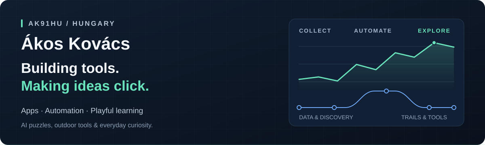

I'm **Ákos**, a builder from Hungary. I make practical apps and playful ways to learn — AI puzzles, outdoor tools, running dashboards and test automation. I like projects that make a complex idea easier to understand or an everyday task easier to do.

**Explore:** [AI puzzle game](https://github.com/ak91hu/PromptQuest) · [HikerAid demo](https://hikeraid.onrender.com) · [Strava dashboard](https://humblebragdashboard.streamlit.app/) · [All repositories](https://github.com/ak91hu?tab=repositories)

## Selected projects

| Project | What it does | Built with |
| :--- | :--- | :--- |
| **[PromptQuest / Asterion Protocol](https://github.com/ak91hu/PromptQuest)** | An orbital puzzle game with 25 fictional AI guards. Learn about prompt injection, agents and trust boundaries through a controlled simulation. | Python · FastAPI · JavaScript · Groq |
| **[HikerAid](https://github.com/ak91hu/hiker-aid)** | GPX route analysis, elevation profiles, turnaround estimates and offline maps for planning a day on the trail. [Try it ↗](https://hikeraid.onrender.com) | Java · Spring Boot · Leaflet · PWA |
| **[HumbleBrag Dashboard](https://github.com/ak91hu/HumbleBragDashboard)** | Strava activities turned into training trends, heatmaps and a few well-earned humblebrags, with daily data sync. [Open dashboard ↗](https://humblebragdashboard.streamlit.app/) | Python · Streamlit · Pandas · Plotly |
| **[Modern HumbleBrag](https://github.com/ak91hu/ModernHumbleBragDashboard)** | A Dash take on running analytics: year-over-year progress, streaks, elevation challenges and calories converted into pizza. [Try it ↗](https://modernhumblebragdashboard.onrender.com/) | Python · Dash · Plotly · GitHub Actions |
| **[Salesforce UI Regression](https://github.com/ak91hu/sf-e2e-tst)** | UI regression coverage for Opportunities, Contracts and Quotes, with page objects, screenshot evidence and Allure reporting. | TypeScript · TesterArmy e2e · Playwright · Allure |
| **[Algorithm Bureau](https://github.com/ak91hu/intergalactic-bureau-of-misplaced-mail)** | Step through nine graph algorithms inside an intergalactic post office. Every decision becomes a bureaucratic memo. | Godot 4 · GDScript · Graph algorithms |

### Small tools, useful automations

- **[Vonalstat](https://github.com/ak91hu/vonalstat)** — a train delay dashboard for Hungary's railway lines 1 and 12.
- **[Stravan-lyzer](https://github.com/ak91hu/stravan-lyzer)** — self-hosted analytics for your exported Strava activity data.
- **[MÁVINFORM Watcher](https://github.com/ak91hu/mavinform-figyelo)** — railway news and disruption alerts delivered to Discord.
- **[Track Closure Watcher](https://github.com/ak91hu/vaganyzar-figyelo)** — new MÁV track closure announcements, dates and PDF links in Discord.
- **[Train Delay Watcher](https://github.com/ak91hu/mav-kesesfigyelo)** — scheduled delay checks for lines 1 and 12, with formatted Discord updates.

## My toolkit

**Build:** Python · Java · TypeScript · FastAPI · Spring Boot · Godot  
**Explore:** Pandas · Plotly · Streamlit · Dash · REST APIs  
**Automate & verify:** Docker · GitHub Actions · Playwright · Allure · Discord webhooks

## What connects these projects

Curiosity, movement and a little humour. I turn questions like *How is my training going? How does this algorithm work? Where does an AI agent's trust break?* into something you can explore, run or play.

If you try one of my projects, ideas and bug reports are welcome in its issue tracker.

<strong>Magyarul 🇭🇺</strong>

Ákos vagyok, Magyarországról. Hasznos alkalmazásokat és játékos tanulási élményeket készítek: AI-rejtvények, túratervezés, Strava-statisztikák, algoritmusvizualizáció és tesztautomatizálás. A kisebb vasúti figyelőim pedig a hétköznapi tájékozódást automatizálják.

A repókban megtalálod a telepítési útmutatókat. Ötleteket és hibajelzéseket szívesen fogadok az adott projekt issue felületén.

